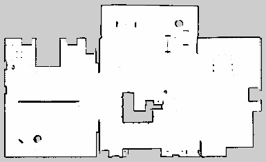
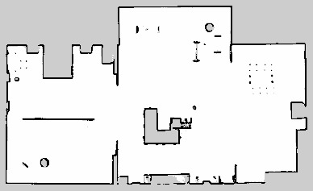
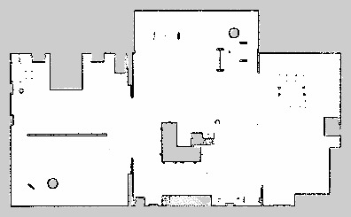
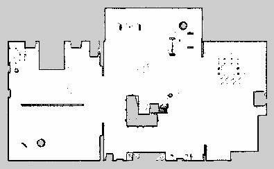

# ROS2 Slam Comparison

## Introduction
This project comprehensively compares different SLAM (Simultaneous Localization and Mapping) techniques using ROS2 and TurtleBot3 in a simulated Gazebo environment. The SLAM algorithms compared in this project are Cartographer and RTAB-Map. The goal is to evaluate their performance using different LIDAR resolutions and determine the most effective SLAM solution for different scenarios.

## Table of Contents
- [Introduction](#introduction)
- [Table of Contents](#table-of-contents)
- [Prerequisites](#prerequisites)
    * [Based on Host Setup](#host-setup-prerequisites)
    * [Based on Docker Setup](#docker-setup-prerequisites)
- [Setup](#setup)
    * [Host Setup](#host-setup)
    * [Docker Setup](#docker-setup)
- [Usage](#usage)
    * [Simulation Environment Launch](#simulation-environment-launch)
    * [Map Generation](#map-generation)
    * [Saving the Map](#saving-the-map)
    * [Navigation](#navigation)
    * [RTAB Map SLAM in Noisy Enviroment](#rtab-map-slam-in-noisy-enviroment)
    * [Demonstration Video](#demonstration-video)
- [Conclusion](#conclusion)
    * [Slam Comparasion](#slam-comparasion)
    * [RTab Map Analysis in Noisy Enviroment](#rtab-map-analysis-in-noisy-enviroment)


## Prerequisites
### Host Setup Prerequisites

1. **Operating System**: Ensure you are running Ubuntu 22.04.
2. **ROS Installation**: Install ROS Humble Desktop Full. You can follow the instructions [here](https://docs.ros.org/en/humble/Installation.html).

### Docker Setup Prerequisites
1. **Operating System**: Ensure you are running Ubuntu 20.04.

2. **Docker**: Install Docker on your system. Follow the instructions [here](https://docs.docker.com/engine/install/ubuntu/).

3. **NVIDIA GPU Support**: If you have an NVIDIA GPU, install NVIDIA Docker support. Follow the instructions [here](https://docs.nvidia.com/datacenter/cloud-native/container-toolkit/install-guide.html). 

**_NOTE_**: _For a detailed guide on setting up NVIDIA GPU support for running GUI applications in Docker containers, refer to this [medium article](https://medium.com/@tanishqchaudhary101010/running-gui-applications-in-docker-containers-with-nvidia-gpu-support-a-guide-using-ros-46a04046c067)._


## Setup 

### Host Setup
1. **Install Dependencies:** Install the required ROS and Python packages:

    ```bash
    sudo apt-get update && \
        apt-get install -y \
        ros-humble-joint-state-publisher \
        ros-humble-tf-transformations \
        ros-humble-gazebo-ros \
        ros-humble-gazebo-ros-pkgs \
        ros-humble-cartographer \
        ros-humble-cartographer-ros \
        ros-humble-rtabmap \
        ros-humble-rtabmap-ros \
        ros-humble-navigation2 \
        ros-humble-nav2-bringup \
        ros-humble-ament-cmake \
        python3-pip 
        
    pip3 install \
        transforms3d \
        opencv-python \
        opencv-contrib-python
    ```

2. **Source ROS Environment:** Add ROS environment setup to your bash configuration:

    ```bash
    echo "source /opt/ros/humble/setup.bash" >> ~/.bashrc
    echo "source /usr/share/gazebo/setup.sh" >> ~/.bashrc
    ```

3. **Create ROS Workspace:** Create a ROS workspace, clone the repository, and build the packages:
    ```bash
    mkdir -p ~/clutterbot/src
    cd ~/clutterbot/src
    git clone https://github.com/Tanishq30052002/ros2-slam-comparison.git

    cd ~/clutterbot
    colcon build --symlink-install
    ```

4. Source the workspace setup:
    ```bash
    echo "source ~/clutterbot/install/setup.bash" >> ~/.bashrc
    ```


### Docker Setup

1. **Clone Repository:** Clone the repository containing Docker setup:
    ```bash
    cd ~
    git clone https://github.com/Tanishq30052002/ros2-slam-comparison.git
    ```

2. **Build Docker Image:** Build the Docker image from the cloned repository:
    ```bash
    cd ~/ros2-slam-comparison
    docker build -t clutterbot:base .
    ```

3. **Start Docker Container:** Start the docker container
    ```bash
    cd ~/ros2-slam-comparison
    docker compose up
    ```

**_NOTE_** _To enable X11 forwarding, run the following command once every time the machine restarts:_

```bash
xhost + local:docker
```

**_Enter Docker Container:_** To enter the Docker container:
```bash
docker exec -it clutterbot bash
```

## Usage
**_NOTE:_** If using docker, then you must need to be inside the docker container for running any  of th efollowing commands

### Simulation Environment Launch
To initialize the simulation environment, execute the following commands based on your desired LiDAR configuration:

1. **Gazebo**
    - LiDAR with Angular Resolution: 0.9
        ```bash
        LIDAR_RESOLUTION=0.9 ros2 launch turtlebot3_burger turtlebot3_aws_small_house_gazebo.launch.py
        ```
    - LiDAR with Angular Resolution: 0.9
        ```bash
        LIDAR_RESOLUTION=2.5 ros2 launch turtlebot3_burger turtlebot3_aws_small_house_gazebo.launch.py
        ```
2. **RViz**
    - To open RViz for sensor analysis, utilize:
        ```bash
        ros2 launch turtlebot3_burger rviz2.launch.py
        ```

### Map Generation
Commence one of the following SLAM algorithms for map generation:
1. **Cartographer SLAM**
    ```bash
    ros2 launch turtlebot3_cartographer cartographer.launch.py
    ```
2. **RTAB-Map SLAM**
    ```bash
    ros2 launch turtlebot3_rtab rtab.launch.py
    ```

Navigate the robot throughout the entire environment to create the map using the Teleop Twist Keyboard:
```bash
ros2 run teleop_twist_keyboard teleop_twist_keyboard
```

### Saving the Map
To save the map, follow these steps:
1. **Change Directory:** Move to the specific map directory based on the SLAM algorithm used and LiDAR resolution:
    ```bash
    cd ~/clutterbot/src/turtlebot3_burger_navigation2/maps/{slam_name}_lidar{resValue}res
    ```
    Replace **{slam_name}** with the name of the SLAM algorithm **_(cart or rtab)_** and **{resValue}** with the resolution value of the LiDAR **_(0-9 or 2-5)_**.

2. **Run Map Saver:** Execute the following command to save the map:
    ```bash
    ros2 run nav2_map_server map_saver_cli -f map
    ```

### Navigation
After saving the map, you can initiate navigation by following these steps:

1. **Change Directory:** Navigate to the directory where the map is saved:
    ```bash
    cd ~/clutterbot/src/turtlebot3_burger_navigation2/maps/{slam_name}_lidar{resValue}res
    ```
    Replace **{slam_name}** with the name of the SLAM algorithm **_(cart or rtab)_** and **{resValue}** with the resolution value of the LiDAR **_(0-9 or 2-5)_**.

2. **Launch Navigation:** Launch the navigation system by executing:
    ```bash
    ros2 launch turtlebot3_burger_navigation2 navigation2.launch.py map:=map.yaml
    ```

**_NOTE:_** Ensure that the map file name matches with the one saved in the previous step (map.yaml). Adjust the path and filenames as necessary based on your setup.

### RTAB Map SLAM in Noisy Enviroment
Commence one of the following command for map generation with RTab Map in noisy enviroment:
```bash
ros2 launch turtlebot3_rtab rtab_with_noise.launch.py
```

### Demonstration Video
Demonstration video showcasing the implementation of Cartographer SLAM and navigation techniques tailored for lidar with a 0.9-degree angular resolution.

[](https://www.youtube.com/watch?v=GPxjGN3jvzo)

## Conclusion
### Slam Comparasion
* **Comparative Observations:**
    1. **% Compute Usage:** In our comparative analysis between RTAB Map and Cartographer SLAM, I observed differences in compute usage. RTAB Map generally exhibited higher compute usage due to its feature-based mapping approach, which involves extensive loop closure detection and graph optimization processes. Conversely, Cartographer SLAM, with its grid-based mapping technique, showed relatively lower compute usage, as it primarily focuses on real-time localization and mapping without extensive graph optimizations.
    2. **Variations in Mapping Output with Varying Input Velocity:** We noticed variations in the mapping output of both RTAB Map and Cartographer SLAM when subjected to varying input velocities. RTAB Map showed robustness in maintaining map consistency at different velocities, thanks to its efficient loop closure detection and pose graph optimization. However, Cartographer SLAM demonstrated slightly better performance at higher velocities, likely due to its grid-based mapping approach, which can handle rapid motion more effectively.

-  **Differences Observed with Lidar Configurations:** Running RTAB Map and Cartographer SLAM with different lidar configurations revealed significant differences in mapping performance. With a low-resolution lidar, RTAB Map struggled to capture fine details and small features in the environment, resulting in less detailed maps compared to Cartographer SLAM. Conversely, Cartographer SLAM demonstrated better resilience to low-resolution lidar inputs, producing more coherent maps with fewer artifacts.

- **Loop Closure/Global Correction Step:** During our tests, both RTAB Map and Cartographer SLAM demonstrated loop closure and global correction steps. However, the frequency and reliability of these steps varied between the two SLAM packages. RTAB Map exhibited more frequent and robust loop closures, facilitated by its feature-based mapping approach and sophisticated loop closure detection algorithms. In contrast, while Cartographer SLAM also performed loop closures, it tended to miss some in larger environments with sparse features. Adjusting loop closure parameters and increasing feature extraction sensitivity could enhance the visibility of these steps in the simulation for both SLAM packages.

- **Recommendation for the Better Package:** Based on my observations, I recommend RTAB Map as the preferred SLAM package for its overall performance and robustness in various scenarios. RTAB Map SLAM also took overall less time to generate the map as compared to Cartographer SLAM. Additionally, RTAB Map's ability to handle varying input velocities and lidar configurations makes it a versatile choice for 2D-SLAM applications. 

Below are the findings derived from the evaluation of various SLAM algorithms across different lidar angular resolutions:

- **Cartographer**

    - **Lidar Resolution: 0.9**
        <div align="center">
        
        <p><em>Fig 1: Map Generated by Cartographer SLAM with 0.9 LiDAR angular resolution</em></p>
        </div>

    - **Lidar Resolution: 2.5**
        <div align="center">
        
        <p><em>Fig 2: Map Generated by Cartographer SLAM with 2.5 LiDAR angular resolution</em></p>
        </div>

- **Rtab Map**

    - **Lidar Resolution: 0.9**
        <div align="center">
        
        <p><em>Fig 3: Map Generated by RTAB MAP SLAM with 0.9 LiDAR angular resolution</em></p>
        </div>

    - **Lidar Resolution: 2.5**
        <div align="center">
        
        <p><em>Fig 4: Map Generated by RTAB MAP SLAM with 2.5 LiDAR angular resolution</em></p>
        </div>

### RTab Map Analysis in Noisy Environment

- **Imperfect Map Formation:** The map generated does not form perfectly due to environmental noise.

- **Increased Iterations:** More iterations are required to achieve a satisfactory map.

- **False Obstacle Detection:** The system not only detects actual obstacles but also incorrectly identifies adjacent areas as obstacles.

- **Extended Mapping Time:** The overall time required to create the final map is significantly longer.

- **Speed Adjustment Benefits:** Operating at a slower speed proves to be beneficial for accurate mapping.
